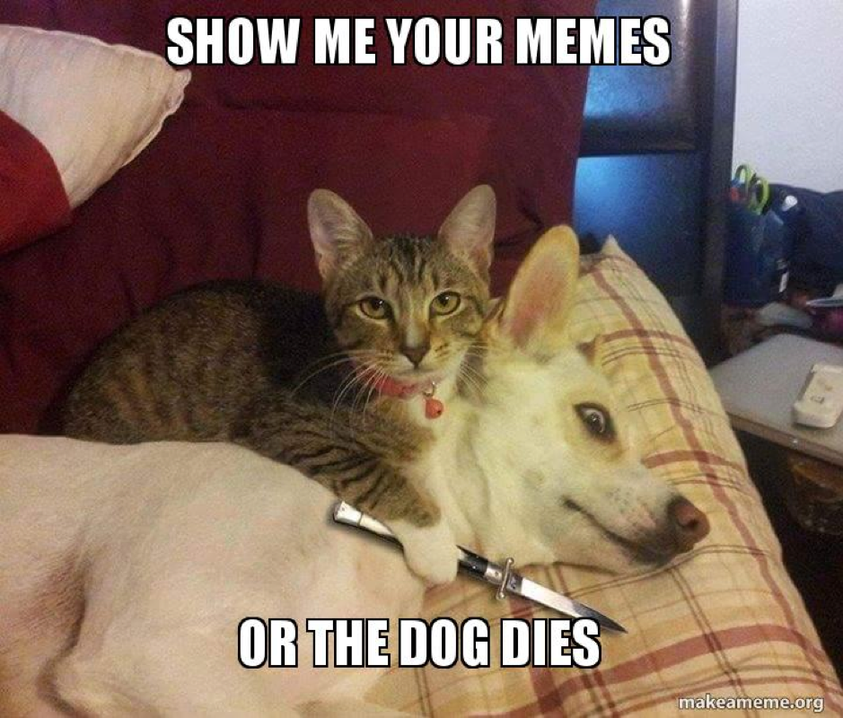

[//]: # (Image References)

[image1]: (./memes/meme1.png?raw=true) “animal meme”
[image2]: ./memes/meme2.png “homer simpson meme”
[image3]: ./memes/meme3.png “correlation meme” 
[image4]: ./memes/meme4.png “correlation meme2” 
[image5]: ./memes/meme5.png “stats meme1”
[image6]: ./memes/meme6.png “skewness meme”
[image7]: ./memes/meme7.png “outlier meme 1”
[image8]: ./memes/meme8.png “outlier meme 2”
[image9]: ./memes/meme9.png “stats meme 2”
[image10]: ./memes/meme10.png “stats meme 3”
[image11]: ./memes/meme11.png “stats meme 4”

# One Git Wonder!  :dancer:
Team motto: Overcommitted :exploding_head:

## Challenge 4 
See [Challenge4.md](Challenge4.md) with links to GitHub repositories managed by National Statistical Offices

We surveyed a really large number of people. Of these respondents, the most confusing stats concepts were as the follows:
Correlation vs Causation
Averages
Type I and Type II errors.

Further, 120% of respondents agreed, yes 120%!
They Agreed they don’t have enough memes in their life.
If fact, the empirical evidence suggests, senior staff at risk of meme deprivation :Face_Screaming_In_Fear:

![animal meme][image1] 

Further we, and YOU, also have a moral imperative to not let this dog die!

![homer simpson meme][image2] 

We’ll try to keep it educational, or at least funny. 

# What is correlation?

![correlation meme][image3]

Yes that is true.
Also, did you know this?!?

![correlation meme2][image4]

Yes Nickolas Cage is very prolific. He’s a very busy boy.

‘Correlation is a statistical measure (expressed as a number) that describes the size and direction of a relationship between two or more variables. correlation between variables, however, does not automatically mean that the change in one variable is the cause of the change in the values of the other variable.

Causation indicates that one event is the result of the occurrence of the other event; i.e. there is a causal relationship between the two events. This is also referred to as cause and effect.’

 For more information see this [authoritative source](https://www.abs.gov.au/websitedbs/D3310114.nsf/home/statistical+language+-+correlation+and+causation)

# So, whats the go with average?

![stats meme1][image5]

The mean is the sum of the value of each observation in a dataset divided by the number of observations. The mean can be used for both continuous and discrete numeric data.
For more information see this authoritative source : [Statistical Language - Measures of Central Tendency (abs.gov.au)] 
(https://www.abs.gov.au/websitedbs/D3310114.nsf/Home/Statistical+Language+-+measures+of+central+tendency#:~:text=There%20are%20three%20main%20measures,central%20value%20in%20the%20distribution.)

“The mean cannot be calculated for categorical data, as the values cannot be summed. As the mean includes every value in the distribution the mean is influenced by outliers and skewed distributions”.

![skewness meme][image6]

![outlier meme 1][image7]

And averages don’t consider outliers. You should pay attention to outliers… Even the outliers you don’t want to pay attention to.

![outlier meme 2][image8]

Averages and correlation are important measures, but won’t tell the full story. For that full story,  you need memes!

![stats meme 2][image9]

It is always important to look for exceptions to the rules. Many measure are proxies.

![stats meme 3][image10]

Some things just don’t make sense.

![stats meme 4][image11]

Tests are also snapshots. They can be wrong. For an authoritative source see Type I and II errors see Type I Error and Type II Error - [Experimental Errors in Research (explorable.com)](https://explorable.com/type-i-error)

Now you can rest easy knowing you've saved a dog's life :angel:

