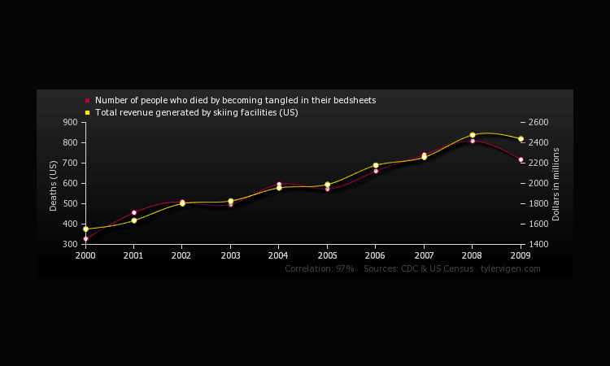
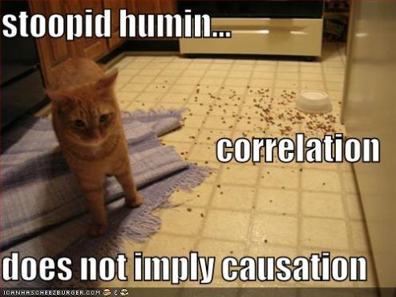

```{r setup, include=FALSE}
knitr::opts_chunk$set(echo = TRUE)
```

## Correlation and causation

A common misconception is that if two things are correlated then one must be causing the other. 

To help us understand this issue further let's ask the experts `r emo::ji("wink")`.  The [ABS describes correlation and causation](https://www.abs.gov.au/websitedbs/D3310114.nsf/home/statistical+language+-+correlation+and+causation) as the following:

"Two or more variables considered to be related, in a statistical context, if their values change so that as the value of one variable increases or decreases so does the value of the other variable (although it may be in the opposite direction).

For example, for the two variables "hours worked" and "income earned" there is a relationship between the two if the increase in hours worked is associated with an increase in income earned. If we consider the two variables "price" and "purchasing power", as the price of goods increases a person's ability to buy these goods decreases (assuming a constant income).

Correlation is a statistical measure (expressed as a number) that describes the size and direction of a relationship between two or more variables. A correlation between variables, however, does not automatically mean that the change in one variable is the cause of the change in the values of the other variable.

Causation indicates that one event is the result of the occurrence of the other event; i.e. there is a causal relationship between the two events. This is also referred to as cause and effect.

Theoretically, the difference between the two types of relationships are easy to identify — an action or occurrence can cause another (e.g. smoking causes an increase in the risk of developing lung cancer), or it can correlate with another (e.g. smoking is correlated with alcoholism, but it does not cause alcoholism). In practice, however, it remains difficult to clearly establish cause and effect, compared with establishing correlation."


## But surely correlation means causation...

As can be clearly seen here:




And of course you cannot have a project without a cat meme



### A subheading....what could be next?

The following text has **no correlation** to the topic but is just an <font size="5">example</font> of <span style="color: red;">having fun</span> in *Rmarkdown*...could <u>this text</u> have a causation on the overall points allocated to our team by the <font size = "10">**amazing judges**</font>? `r emo::ji("smile")`

And finally a plot using R code within Rmarkdown...because we can... clearly showing that the further you need to drive (dist) the faster you are allowed to drive. Happy driving.


```{r pressure, echo=FALSE}
plot(cars)
```


